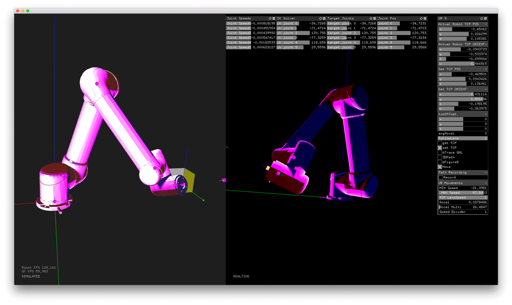
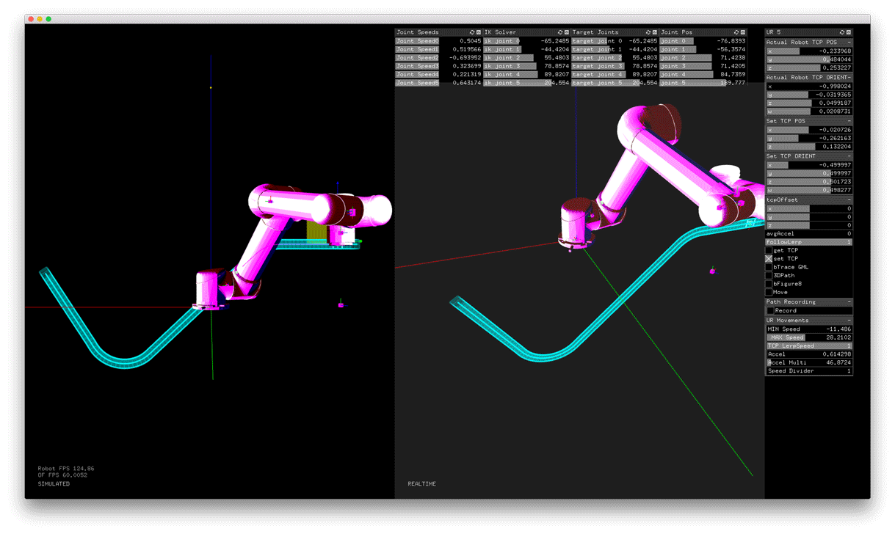

# ofxRobotArm
###### An openFrameworks addon for controlling and interacting with robot arms.

  - [About](#about)
  - [Dependencies](#dependencies)
  - [Overview](#overview)
  - [Getting Started](#getting-started)
  - [Examples](#examples)
  - [Licensing](#licensing)
  - [Contact Info](#contact-info)
  - [Additional Resources](#additional-resources)
  - [Known Issues](#known-issues)

## About
`ofxRobotArm` is an openFrameworks addon for doing creative things with robot arms. The goal of the addon is to remove as many technical barriers as possible to get up and running with 6-axis robots. We've included a number of examples that show you how different ways of controlling and interacting with a robot arm, including direct manipulation, geometry-based manipulation, motion capture-based interactions, and keyframe animation. By developing `ofxRobotArm` for openFrameworks, we hope to help you extend human-robot interaction in new and diverse ways.

Currently the addon is configured to just work with Universal Robot's [UR5](http://www.universal-robots.com/products/ur5-robot/) robot. In future developments, we would like to include kinematic models for additional robot brands. Please [contact us]() if you would like us to include your robot model or if you would like specific features implemented.

Development for `ofxRobotArm` was sponsored by [The Frank-Ratchye STUDIO for Creative Inquiry](http://studioforcreativeinquiry.org/). 
Technical development was lead by [Dan Moore](http://makeitdoathing.com) with examples by [Madeline Gannon](https://atonaton.com).

.gif)

## Dependencies
After download, you can run the `installAddons.sh` script to clone all the external addons used in the `ofxRobotArm` examples.  

- ofxURDriver
- ofxCV
- ofxGizmo
- ofxTimeline
- ofxPtf

## Overview
`ofxRobotArm` is structured as two parts: `ofxURDriver` holds the specific control software and kinematic model for a [UR5](http://www.universal-robots.com/products/ur5-robot/) robot; `ofxRobotArm` holds the generic tools and techniques for controlling and interacting with a robot arm. `ofxURDriver` adapts ThomasTimm's [ur_modern_driver](https://github.com/ThomasTimm/ur_modern_driver) package for ROS to openFrameworks. To customize `ofxRobotArm` to work with your specific model and brand of robot, use `ofxURDriver` as a template for your robot's kinematic model and control protocol.

## Examples
We've also included a number of example projects that show you the most common ways of programming 6-axis robots:

**1. Direct Manipulation**
 - [`example-basic-move`](/example-basic-move) lets you use your mouse to drag around and rotate your robot.
 

**2. Timeline & KeyFramed Animation**
 - [`example-timeline`](/example-timeline) lets you use build keyframed animations to record and play robot movements.

**3. Geometry-Driven Movements**
 - [`example-follow-path`](/example-follow-path) lets you import 2D and 3D paths for the robot to follow.

 - [`example-follow-surface`](/example-follow-surface) lets you project paths on a 3D surface for the robot to follow.

**4. Motion Capture Based Interactions**
 - [`example-follow-mocap`](/example-follow-mocap) lets the robot follow a rigid body detected by an OptiTrack Motion Capture System.

 - [`example-follow-mocap-path`](/example-follow-surface) lets you record a path for the robot follow using an OptiTrack Motion Capture System.

##Getting Started
We've included a tutorial for getting started with `ofxRobotArm` [here](/example-basic-move/README.md). 

1. Start with [`example-basic-move`](/example-basic-move) to learn how set up your robot for open-loop control, and to get the basic structure and workflow for `ofxRobotArm`.
2. Next try [`example-timeline`](/example-timeline).
3. After that, move on to the geometry examples: [`example-follow-path`] (/example-follow-path) and [`example-follow-surface`] (/example-follow-surface).
4. The motion capture examples [`example-follow-mocap`](/example-follow-mocap) and [`example-follow-mocap-path`](/example-follow-mocap-path) are fairly advanced and require very specific hardware configurations to run properly. A more common motion capture sensor, like a Kinect, could be used in place of an OptiTrack system to get similar results.

## Licensing
`ofxRobotArm` is licensed for **NON-COMMERCIAL USE ONLY**. 

Copyright (c) 2016, Daniel Moore, Madeline Gannon, and The Frank-Ratchye STUDIO for Creative Inquiry
All rights reserved.

Redistribution and use in source and binary forms, with or without
modification, are permitted provided that the following conditions are met:

1. Redistributions of source code must retain the above copyright
   notice, this list of conditions and the following disclaimer.
2. Redistributions in binary form must reproduce the above copyright
   notice, this list of conditions and the following disclaimer in the
   documentation and/or other materials provided with the distribution.
3. All advertising materials mentioning features or use of this software
   must display the following acknowledgement:
   This product includes software developed by Daniel Moore, Madeline Gannon, and The Frank-Ratchye STUDIO for Creative Inquiry.
4. Neither the name of Daniel Moore, Madeline Gannon, and The Frank-Ratchye STUDIO for Creative Inquiry 
   nor the names of its contributors may be used to endorse or promote products
   derived from this software without specific prior written permission.
5. The terms of this License form a binding agreement between you, an individual user or non-commercial organization ("you" or "your"), and us  
   regarding your non-commercial use of this software. By downloading, accessing or otherwise using this software you indicate your agreement to be bound by these License terms.

**PLEASE NOTE THAT THIS LICENSE IS INTENDED FOR NON-COMMERCIAL USE ONLY. IF YOU INTEND TO USE THIS SOFTWARE FOR A COMMERCIAL PURPOSE, PLEASE CONTACT *dan@makeitdoathing.com* TO ARRANGE A COLLABORATION AGREEMENT WITH US BASED ON OUR COMMERCIAL LICENSE TERMS.**

THIS SOFTWARE IS PROVIDED BY Daniel Moore, Madeline Gannon, 
and The Frank-Ratchye STUDIO for Creative Inquiry ''AS IS'' AND ANY
EXPRESS OR IMPLIED WARRANTIES, INCLUDING, BUT NOT LIMITED TO, THE IMPLIED
WARRANTIES OF MERCHANTABILITY AND FITNESS FOR A PARTICULAR PURPOSE ARE
DISCLAIMED. IN NO EVENT SHALL Daniel Moore, Madeline Gannon, 
and The Frank-Ratchye STUDIO for Creative Inquiry BE LIABLE FOR ANY
DIRECT, INDIRECT, INCIDENTAL, SPECIAL, EXEMPLARY, OR CONSEQUENTIAL DAMAGES
(INCLUDING, BUT NOT LIMITED TO, PROCUREMENT OF SUBSTITUTE GOODS OR SERVICES;
LOSS OF USE, DATA, OR PROFITS; OR BUSINESS INTERRUPTION) HOWEVER CAUSED AND
ON ANY THEORY OF LIABILITY, WHETHER IN CONTRACT, STRICT LIABILITY, OR TORT
(INCLUDING NEGLIGENCE OR OTHERWISE) ARISING IN ANY WAY OUT OF THE USE OF THIS
SOFTWARE, EVEN IF ADVISED OF THE POSSIBILITY OF SUCH DAMAGE.

## Contact Info
**Dan Moore** | [Make It Do A Thing!](http://www.makeitdoathing.com ) | [@danzeeeman](https://github.com/danzeeeman)

**Madeline Gannon** | [A TON A TON](http://atonaton.com) | [@madelinegannon](https://github.com/madelinegannon)

**The Frank-Ratchye STUDIO for Creative Inquiry** | [studioforcreativeinquiry.org](http://studioforcreativeinquiry.org) | [@creativeinquiry](https://github.com/CreativeInquiry)

## Additional Resources
Here are some of the references and resources that have made `ofxRobotArm` possible:

- [ur_modern_driver](https://github.com/ThomasTimm/ur_modern_driver)
- [Script Manual](https://s3-eu-west-1.amazonaws.com/ur-support-site/18679/scriptmanual_en.pdf)
- [UR Kinematics](https://smartech.gatech.edu/bitstream/handle/1853/50782/ur_kin_tech_report_1.pdf)
- [UR Report](http://orbit.dtu.dk/files/117833332/Universal_Robot_report.pdf)

## Known Issues
 There are several known issues:

 

## Future Development

* Collision Detection
* More Robot Arms!

